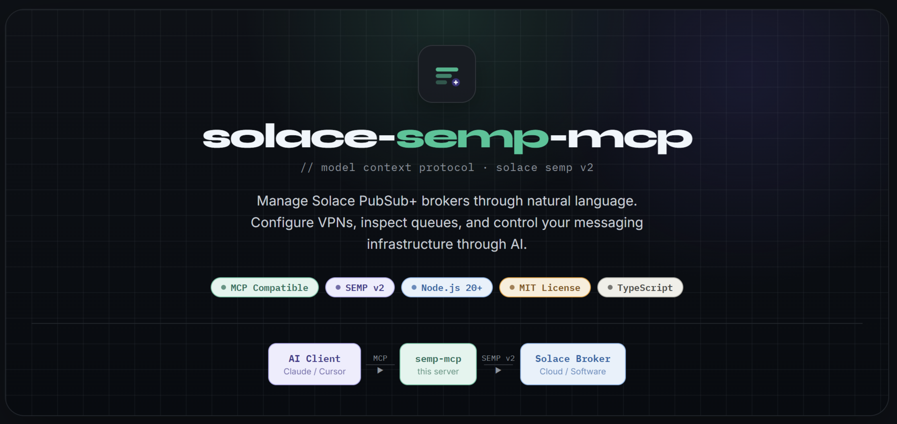

<p align="center">
  
</p>

<p align="center">
  <a href="./QUICKSTART.md">Quickstart</a> •
  <a href="./doc/tools-reference.md">Tools Reference</a> •
  <a href="./doc/connecting-to-claude-code.md">Connecting to Claude</a> •
  <a href="./CONTRIBUTING.md">Contributing</a> •
  <a href="./LICENSE">License</a>
</p>

<p align="center">
  <a href="https://www.npmjs.com/package/@tanendra77/solace-semp-mcp">
    
  </a>
</p>

---

## Overview

`solace-semp-mcp` is a Model Context Protocol server for Solace PubSub+ brokers. It exposes curated tools for broker inspection, queue and client operations, ACL and profile management, diagnostics, and a guarded SEMP passthrough.

The server can run over:

- `stdio` for local MCP clients such as Claude Code or desktop-style integrations
- `sse` for HTTP/SSE-based MCP clients and remote integrations

## Features

- Broker registration from `brokers.json` and environment variables
- Read-oriented broker, VPN, queue, client, ACL, and profile tools
- Dry-run confirmation for write and delete operations
- Optional raw `semp_request` passthrough with mode controls
- Structured logging to console and log files
- Unit test coverage for broker loading, SEMP client behavior, safety, and tool handlers

## Repository Layout

```text
src/
  brokers/      Broker config loading and in-memory registry
  safety/       Risk tiers and dry-run confirmation helpers
  semp/         Solace SEMP HTTP client and error mapping
  tools/        MCP tool registration and handlers
  transport/    stdio and SSE transports
  index.ts      App entrypoint
  server.ts     MCP server factory
  logger.ts     Winston logger setup

tests/          Jest tests for src/
dist/           Compiled JavaScript output generated by TypeScript
doc/            Reference notes and design material
```

## Requirements

- Node.js `20+`
- npm `10+` recommended
- Reachable Solace PubSub+ broker with SEMP v2 enabled

## Installation

Package on npm: [npmjs.com/package/@tanendra77/solace-semp-mcp](https://www.npmjs.com/package/@tanendra77/solace-semp-mcp)

```bash
npm install
```

## Configuration

### Option A: `brokers.json`

Create a `brokers.json` file in the repository root:

```json
{
  "brokers": [
    {
      "name": "dev-broker",
      "label": "Development Broker",
      "url": "http://localhost:8080",
      "username": "admin",
      "password": "admin"
    }
  ]
}
```

Use [brokers.json.example](./brokers.json.example) as a starting point.

### Option B: Environment Variables

You can also register brokers through environment variables:

```bash
SEMP_BROKER_DEV_URL=http://localhost:8080
SEMP_BROKER_DEV_USERNAME=admin
SEMP_BROKER_DEV_PASSWORD=admin
SEMP_BROKER_DEV_LABEL=Development Broker
```

### Runtime Variables

Common runtime options:

- `MCP_TRANSPORT`: `stdio` or `sse`
- `PORT`: HTTP port for SSE mode, default `3000`
- `MCP_API_KEY`: bearer token required in SSE mode
- `MCP_RATE_LIMIT_RPS`: request rate limit for SSE mode, default `10`
- `SEMP_TIMEOUT_MS`: upstream SEMP timeout, default `10000`
- `SEMP_PASSTHROUGH_MODE`: `disabled`, `monitor_only`, or `advanced`
- `MESSAGE_PAYLOAD_PREVIEW_BYTES`: payload preview limit for queue message browsing
- `LOG_LEVEL`: `error`, `warn`, `info`, or `debug`

## Development

Run the TypeScript server directly:

```bash
npm run dev
```

Build the compiled output:

```bash
npm run build
```

Run tests:

```bash
npm test
```

Collect coverage:

```bash
npm run test:coverage
```

## Docker

### Quick start (SSE mode)

Image on Docker Hub: [tanendra/solace-semp-mcp](https://hub.docker.com/r/tanendra/solace-semp-mcp)

```bash
docker run -d -p 3000:3000 \
  -e SEMP_BROKER_MY_BROKER_URL=http://your-solace-host:8080 \
  -e SEMP_BROKER_MY_BROKER_USERNAME=admin \
  -e SEMP_BROKER_MY_BROKER_PASSWORD=admin \
  -e SEMP_BROKER_MY_BROKER_LABEL="My Broker" \
  tanendra/solace-semp-mcp:latest
```

Health check: `curl http://localhost:3000/health`

### Using docker compose

Copy `.env.example` to `.env` and fill in your values:

```bash
cp .env.example .env
docker compose up -d
```

`docker-compose.yml` forces `MCP_TRANSPORT=sse` so the service stays compatible with its HTTP health check even if `.env` still has `MCP_TRANSPORT=stdio`.

To load brokers from a file instead of env vars, uncomment the `brokers.json` volume mount in `docker-compose.yml`.

### stdio mode (for Claude Desktop / Claude Code via docker)

```bash
docker run -i --rm \
  -e MCP_TRANSPORT=stdio \
  --no-healthcheck \
  tanendra/solace-semp-mcp:latest
```

The `--no-healthcheck` flag is required in stdio mode because the HTTP server is not started and the built-in health check would otherwise mark the container as unhealthy. Requires Docker Engine 25.0+; use `--health-cmd=none` on older versions.

### Building locally

```bash
docker build -t solace-semp-mcp:dev .
```

Pass `--build-arg VERSION=1.0.0` to set the `org.opencontainers.image.version` label.

### Publishing (automated)

The GitHub Actions workflow at `.github/workflows/docker-publish.yml` builds and pushes a multi-platform image (`linux/amd64`, `linux/arm64`) to Docker Hub automatically when you push a version tag:

```bash
git tag v1.0.0
git push --tags
```

Requires `DOCKERHUB_USERNAME` and `DOCKERHUB_TOKEN` repository secrets to be configured.

## Running The Server

### stdio mode

Use `stdio` when the MCP client launches the process locally.

```bash
npm run build
node dist/index.js
```

Or explicitly:

```bash
MCP_TRANSPORT=stdio node dist/index.js
```

### SSE mode

Use `sse` when the client expects an HTTP endpoint.

```bash
MCP_TRANSPORT=sse PORT=3000 node dist/index.js
```

Available endpoints:

- `GET /sse`
- `POST /messages?sessionId=...`
- `GET /health`

If `MCP_API_KEY` is set, send `Authorization: Bearer <token>`.

## Connecting From MCP Clients

### Claude Code

The fastest way — no Docker, no cloning, no build step:

```bash
npx @tanendra77/solace-semp-mcp setup
```

The interactive wizard asks for scope (global or project) and your broker details, then writes the config automatically. See [doc/connecting-to-claude-code.md](./doc/connecting-to-claude-code.md) for the full setup guide.

Alternatively, configure manually with a JSON block:

```json
{
  "mcpServers": {
    "solace-semp": {
      "command": "npx",
      "args": ["-y", "@tanendra77/solace-semp-mcp@latest"],
      "env": {
        "MCP_TRANSPORT": "stdio",
        "SEMP_BROKER_MY_URL": "http://your-solace-host:8080",
        "SEMP_BROKER_MY_USERNAME": "admin",
        "SEMP_BROKER_MY_PASSWORD": "yourpassword",
        "SEMP_BROKER_MY_LABEL": "MyBroker"
      }
    }
  }
}
```

### HTTP/SSE Clients

Run the server with `MCP_TRANSPORT=sse` and configure the client to connect to:

- `http://<host>:<port>/sse`
- `http://<host>:<port>/messages`

## Available Tool Groups

- Broker tools: list, add, remove, version, summary
- Monitor tools: broker health, VPN listing, redundancy, config sync
- Queue tools: list queues, inspect stats, manage config, clear or delete
- Client tools: list clients, subscriptions, connections, disconnect, clear stats
- ACL/Profile tools: ACL profiles, client usernames, client profiles
- Diagnostic tools: backlogged queues, idle consumers, message lag
- Passthrough tool: guarded raw SEMP requests

## Safety Model

Write and delete operations are dry-run by default. To execute a risky action, call the same tool again with `confirm: true`.

This logic lives in [src/safety/confirmation.ts](./src/safety/confirmation.ts) and is part of the public behavior of this server.

## Logs

Logs are written to the console and to the `logs/` directory. Increase `LOG_LEVEL=debug` when troubleshooting request flow or transport issues.

## Documentation

- [QUICKSTART.md](./QUICKSTART.md) — fastest path to getting started
- [doc/connecting-to-claude-code.md](./doc/connecting-to-claude-code.md) — detailed Claude Code setup
- [doc/tools-reference.md](./doc/tools-reference.md) — every tool, endpoint, and safety tier
- [doc/docker.md](./doc/docker.md) — production Docker deployment
- [doc/DEPLOYMENT.md](./doc/DEPLOYMENT.md) — general deployment notes
- [CONTRIBUTING.md](./CONTRIBUTING.md) — development and PR guidelines
- [CODE_OF_CONDUCT.md](./CODE_OF_CONDUCT.md) — community standards
- [CHANGELOG.md](./CHANGELOG.md) — release history and feature list
- [VERSIONING.md](./VERSIONING.md) — release and versioning policy
- [LICENSE](./LICENSE)

## Releases

| Version | Date | Notes |
|---------|------|-------|
| [v1.0.0](https://github.com/Tanendra77/solace-semp-mcp/releases/tag/v1.0.0) | 2026-03-22 | Initial release — 47 tools, stdio + SSE transports |

## Known Limitations

- SSE transport currently behaves as a single active MCP server session implementation; `stdio` is the safer default for local usage.
- Jest currently emits a `ts-jest` deprecation warning from the existing config shape.

## License

Released under the [MIT License](./LICENSE).
